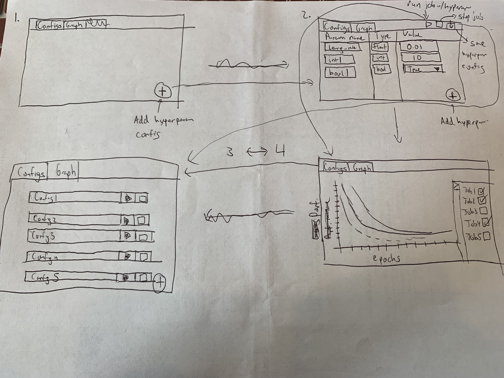

- Start Date: 08/09/2019

# Summary

This is an RFC to make the React Application for the hyperTuner application. 
This application will serve as the frontend for the hyperparameters tuning page, Graph page, and Past Parameters page.

# Motivation

Tuning an ML model is an expensive and time-consuming process that requires the user to tune various hyperparameters in different ways to see the effect on the performance of the model. Additionally, there is no easy/standard way for the user to organize and store their past hyperparameters and compare the performance of the different hyperparameters against each other. 
 
This React application will give the user a UI by which they can edit, save, and run their models with different hyperparameters and compare the performance of the hyperparameters against each other. 

## Reasons for UI

* Different users can have different conventions for saving and using hyperparameters. A given UI allows for users to quickly add, change, and remove hyperparameters from their model, in an easy-to-use standard method.

* No standard way of saving and accessing different hyperparameter configurations among different users. UI provides a tool to easily access past hyperparameter configurations for users to edit. 

* Running and evaluating the model(s) performance amongst different hyperparameters is typical boilerplate code. UI abstracts this unnecessary boilerplate into a graph that measures performance of different hyperparameter settings.

# Design sketch

1. The initial home page of hyperTuner application that displays an empty "Configs" tab. Currently there are no hyperparameter configs displayed, user is directed to add a new hyperparameter configuration by using the add button in the corner. 
2. The UI for adding, removing, and changing hyperparameters. Users can indicate the hyperparameter name, type (integer, float, boolean),and value that matches the type. On the upper right corner, users can run the model with the current hyperparameter configuration, stop the current run, or simply save the hyperparameter configuration. 
3. If the user saves the hyperparameter configuration, the user is directed to the "Configs" tab to see all past saved hyperparameter configurations. From here users can access any past configurations, run the configuration, or stop the running of the configuration. 
4. The graph page can be accessed clicking on the "Graphs" tab. Once model configurations have been run, a graph of model performance(s) with the various hyperparameter configurations will be displayed. Users can choose with the sidebar which already run configurations they want to compare. 

Ideal use case for this application is for the user to experiment with different hyperparameter configurations, compare with past configuration performance, and optimize their model. 

# Detailed design

TBD React Component organization and connection

# Alternatives

Main alternative to this is for users (or groups of users) to define their own hyperparameter configuration saving strategy and operate as they are. 

# Unresolved questions

??